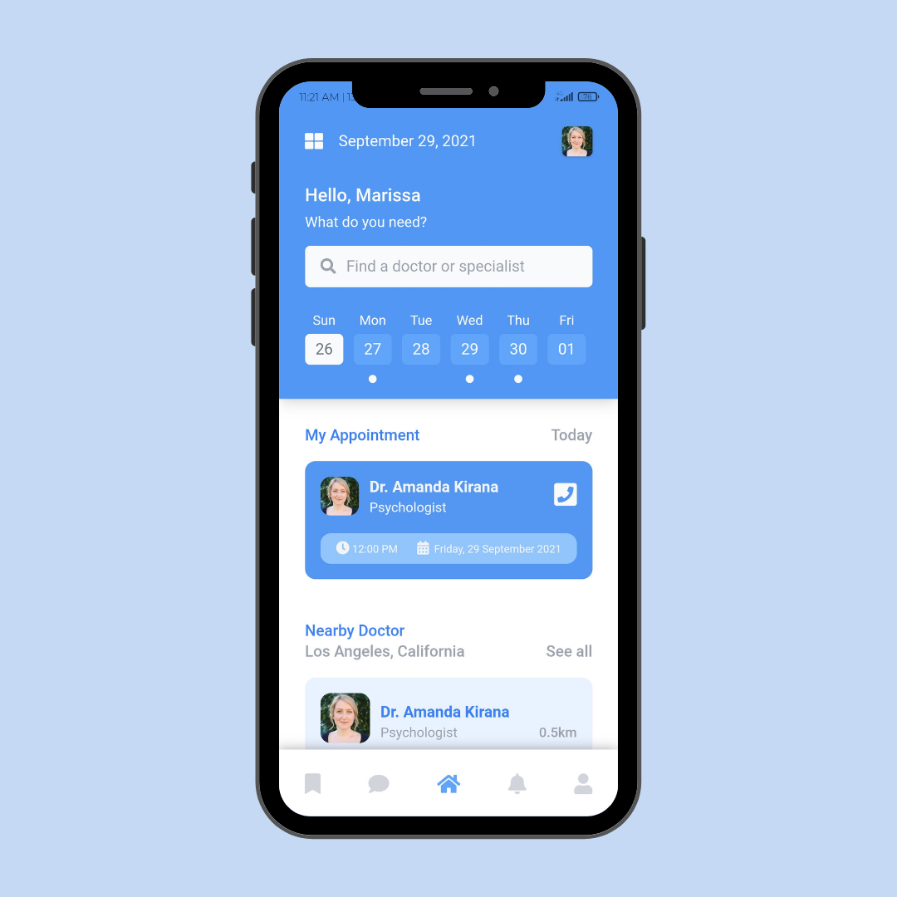

<h3 align="center">Doctalk - Online Medical App</h3>

Slicing project #04

### About
This is my projects to make UI using front end tech 

Where the ideas and the concept i use from any other designer UI/UX from Instagram or Dribbble

### Languages and Tools
- Vue Js 3
- Tailwindcss
- Google Font Poppins
- FontAwesome
- Termux
- Vite Js
- Acode code editor

### Clone This Repo
- <code>git clone https://github.com/bagussatoto/HelloDoc.git </code>
- <code>cd HelloDoc</code>
- <code>npm install</code>
- <code>npm run dev</code>

### Demo 
- [Doctalk - Online Medical App](https://doctalk.vercel.app/)

